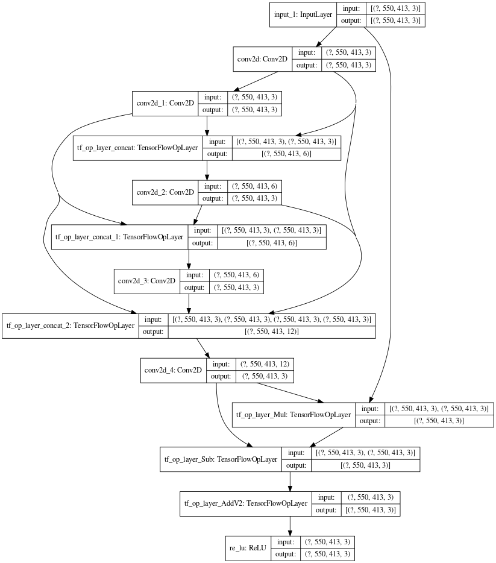

# Image Dehazing using AOD net  

## Requirements:  
- Tensorflow (Version 2+)  
- GPU used: Nvidia K80 (provided by colab)  


Training of model is done.  
Tasks remaining:  
1. Testing on real images.
2. Prepare Documentation.
3. Add references.  
  
In case if notebook isn't loading here, click this link: https://nbviewer.jupyter.org/github/sanchitvj/AOD-net-using-TF-v2/blob/master/dehazing_using_tf2.ipynb   

## Architecture  
  
  
### Citation

```
@InProceedings{Li_2017_ICCV,
author = {Li, Boyi and Peng, Xiulian and Wang, Zhangyang and Xu, Jizheng and Feng, Dan},
title = {AOD-Net: All-In-One Dehazing Network},
booktitle = {The IEEE International Conference on Computer Vision (ICCV)},
month = {Oct},
year = {2017}
}
```
